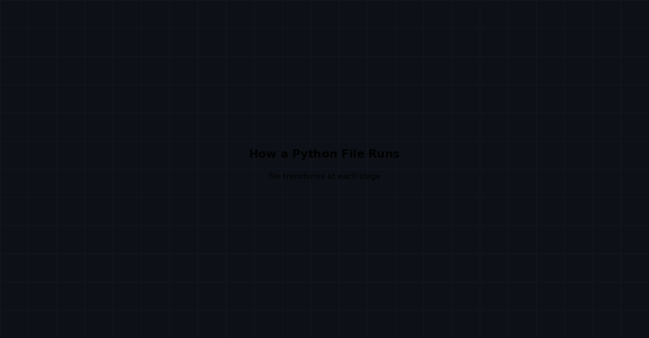

## What is Python?

Python is a **high-level, interpreted programming language** known for its clean, readable syntax that reads almost like plain English. It handles the complex parts of programming (memory, types) so you can focus on solving problems.

---

## Who Invented It?

**Guido van Rossum** created Python in 1989 while working at CWI (Netherlands). He wanted a language that was simple and enjoyable to use. The first public release came in **1991**. The name comes from *Monty Python's Flying Circus* — not the snake.

---

## Where is Python Used?

| Area | Examples |
|---|---|
| 🤖 **AI & Machine Learning** | TensorFlow, PyTorch, scikit-learn |
| 🌐 **Web Development** | Django, Flask, FastAPI |
| 📊 **Data Science** | Pandas, NumPy, Matplotlib |
| 🔧 **Automation & Scripting** | File tasks, bots, system tools |
| ☁️ **Cloud & DevOps** | AWS scripts, Ansible, CI pipelines |
| 🎮 **Game Dev** | Pygame, Blender scripting |

---

## How a Python File Runs

When you run `python script.py`, four things happen in sequence:

1. **Tokenizer** — reads your text and splits it into small pieces (tokens) like keywords, numbers, and symbols
2. **Parser** — arranges those tokens into a tree structure (AST) that represents the logic of your code
3. **Compiler** — converts the tree into **bytecode** — a compact, low-level set of instructions
4. **Python VM** — reads each bytecode instruction and executes it on your CPU

> **Shortcut on repeated runs:** The bytecode is saved as a `.pyc` file in `__pycache__`. Next time you run the same file, steps 1–3 are skipped entirely — Python jumps straight to execution.

---

## Why Python?

- **Beginner-friendly** — minimal syntax, no semicolons or braces required
- **Cross-platform** — runs on Windows, macOS, and Linux without changes
- **Huge ecosystem** — over 500,000 packages on PyPI
- **Versatile** — the same language powers a beginner's first script and Netflix's backend

---

